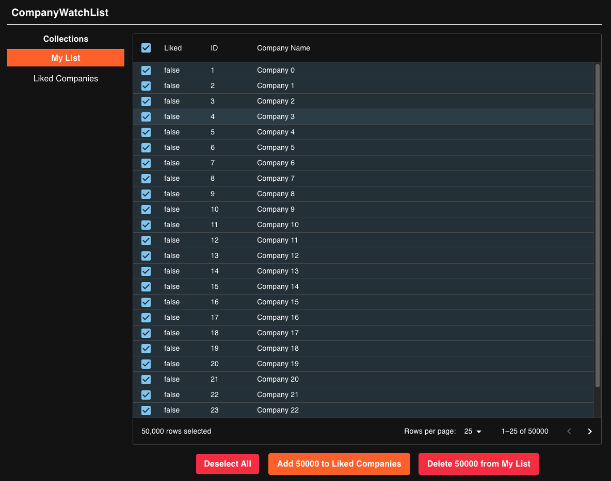

# CompanyWatchList

## High Level Overview

CompanyWatchList is an application that allows a user to curate two lists of hypothetical companies: "My List" and "Liked Companies." The user can add a specific company, group of companies, or all companies from list to another - deletions are possible. A progress bar with an estimated time remaining alert allows for a considerate and smooth user experience when particularly large operations are loading (i.e. all 50,000 companies are moved from one list to another).





In this repo, you'll find 2 deployable services:
1. Backend - dockerized deployable that will spin up a Python backend with FastAPI, Postgres SQL DB and some seeded data
2. Frontend - locally deployable app via Vite with TypeScript/React

### Backend

#### Setup

1. Make sure you are in the backend directory:
   ```bash
   pwd
   > company-watch-list/backend
   ```
2. Ensure you have Python 3.9 installed (this repo was created with 3.9.16)
3. `poetry install` ([install poetry](https://python-poetry.org/docs/#installation) if you don't have it yet)
4. Followed by `docker-compose up`
5. Navigate to http://localhost:8000/docs to see your FastAPI server
6. (for dev) In VSCode, select your Python Interpreter (CMD+P) to use the poetry created environment:
   

You can find the list of environments via: `poetry env list` and the currently active venv for poetry via: `poetry env info`

#### Seeding Data

The database will automatically get seeded (see main.py) with:

- 100K companies
- List 1: 'My List' with 50k companies
- List 2: 'Liked Companies' with 10 companies

#### Reset Docker Container

1. Run `docker-compose down`
2. Run `docker volume rm backend_postgres_data`
3. Run `docker-compose build --no-cache` to force rebuild
4. Followed by `docker-compose up`
5. Navigate to http://localhost:8000/docs to see your FastAPI server

#### Accessing the DB

1. SSH into the postgres container: `docker exec -it backend-postgres-companywatchlist-db-1 /bin/bash`
2. Run `psql -U postgres companywatchlist` to open the Postgres interface
3. Run `\dt` to list all tables and confirm you are connected
4. Execute any SQL query: `SELECT * FROM companies;`

### Frontend

#### Setup
1. Ensure you have either node v18+ or v20+ installed ([install node](https://nodejs.org/en/download/package-manager/all) if you don't have it yet)
2. Make sure we are in the frontend directory:
    ```bash
    pwd
    > company-watch-list/frontend
    ```
3. Run `npm install`
4. Followed by `npm run dev`
5. Navigate to http://localhost:5173 to see your React server
